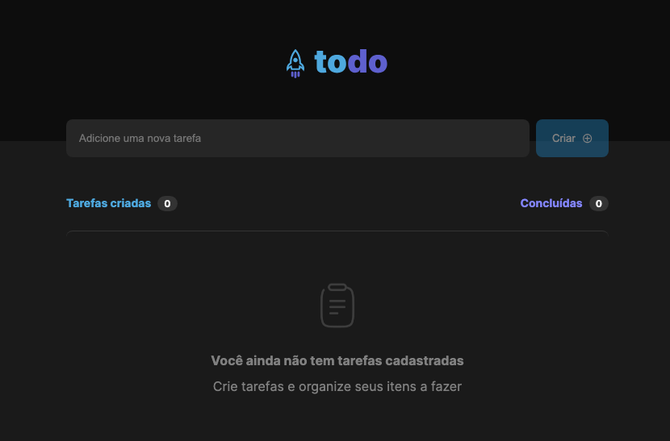
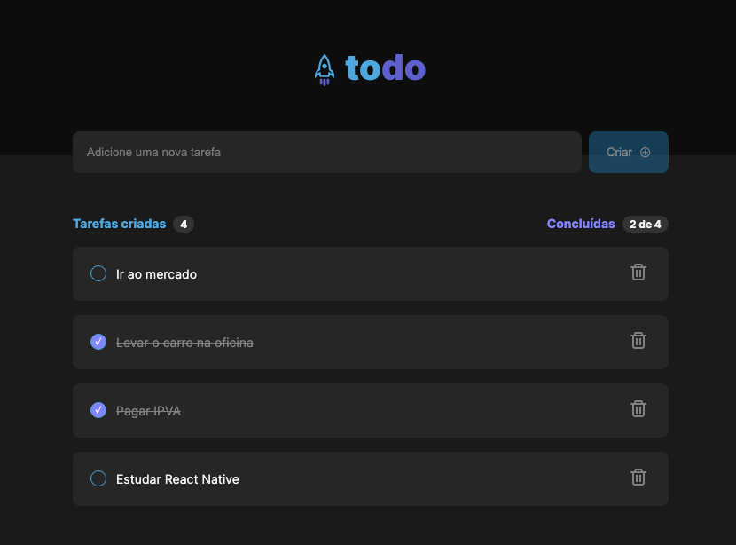

# Rocketseat's React.js trainning - First code challenge

[TODO App (Final result)](https://rocketseat-react-challenge-1.vercel.app/)

----

[Instructions](https://efficient-sloth-d85.notion.site/Desafio-01-Praticando-os-conceitos-do-ReactJS-91fd63dd1a5b4a2796152de293ec1074)

[Figma layout - Duplicate](https://www.figma.com/file/0n0zDN7zbzhRbaEO74Xesx/ToDo-List/duplicate)

## App home

 
 ## Tasks list

